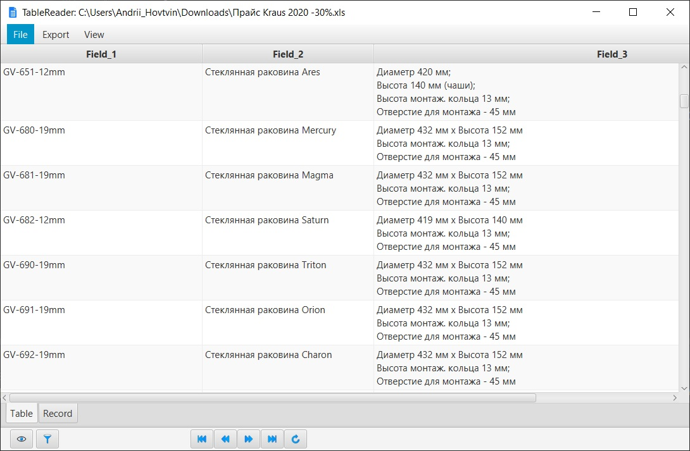
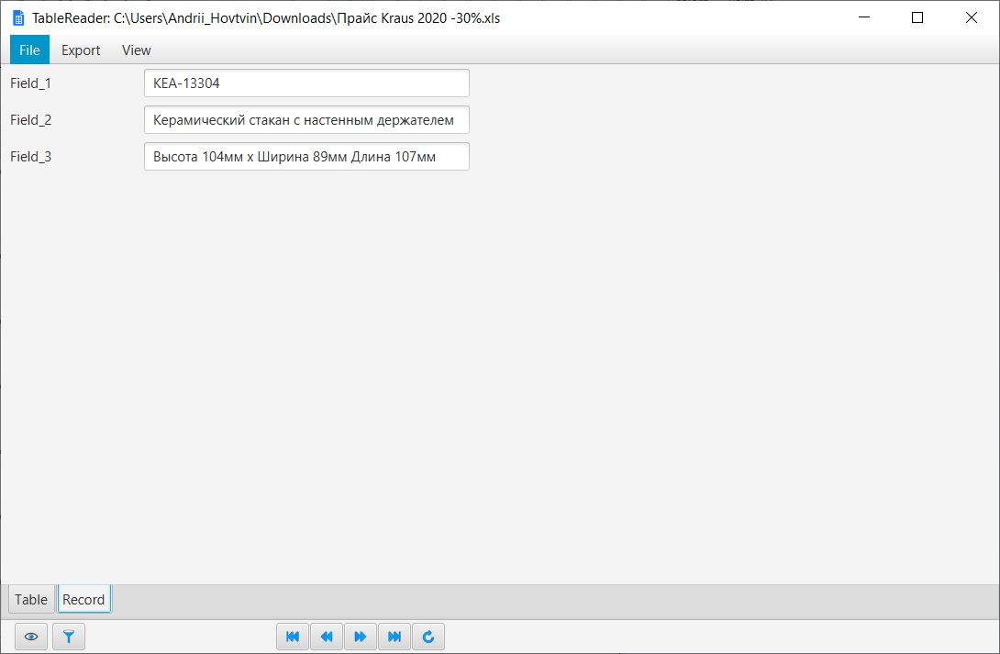
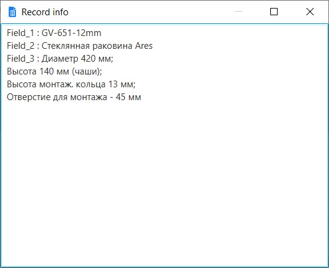
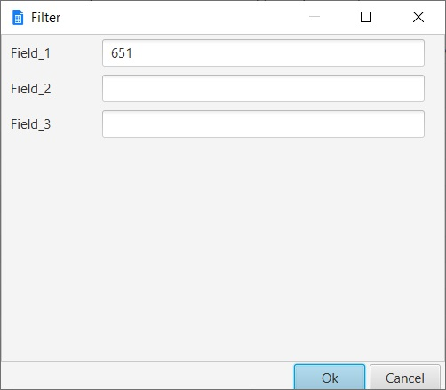
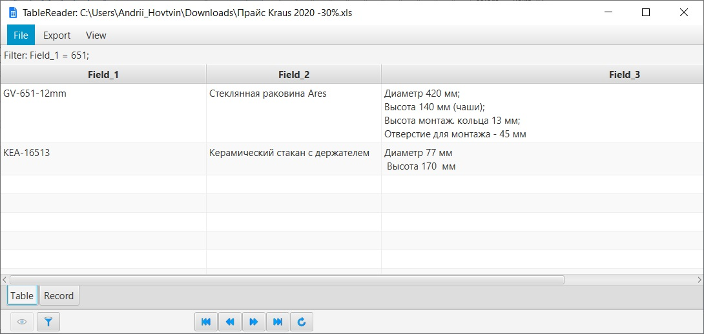

Java FX application for reading Excel or DBF files for viewing or exporting them to **TXT**, **XLS**, **XLSX**, **SQL**
formats.

#### Screenshot with example

*Main window with open table:*

*Table record:*

*Record info dialog:*

*Filter dialog:*

*Filtered table:*

### **For work needs:**

- IDE
- JDK 1.8 or later
- Maven

### **TODO:**

Add code coverage